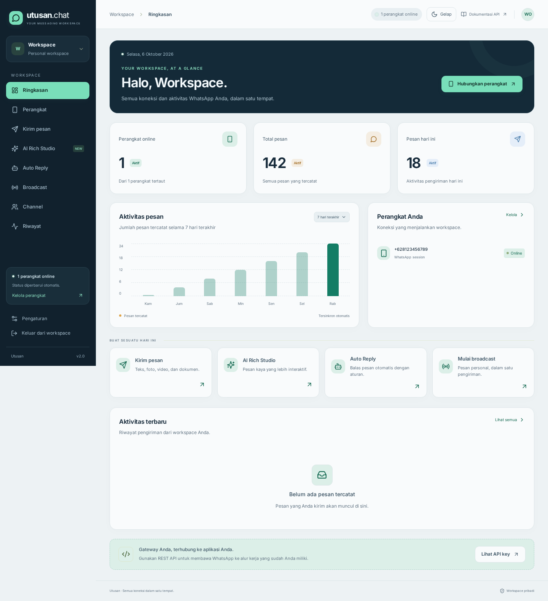
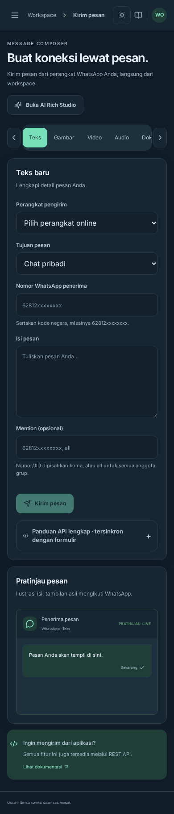

<div align="center">

# Utusan · WhatsApp Workspace

**Kelola perangkat, pesan, AI Rich, dan otomatisasi dalam satu dashboard.**

[Website](https://utusan.chat) · [Dokumentasi API](https://utusan.chat/docs) · [Repository](https://github.com/Nauvalunesa/Wa-gateway)


</div>

Utusan adalah gateway WhatsApp multi-session dengan dashboard React dan REST API Python. Setiap akun mempunyai perangkat, riwayat, API key, dan aturan auto-reply sendiri. Dashboard memakai cookie login; integrasi eksternal memakai API key.

## Tampilan



<details>
<summary>Lihat composer mobile dalam mode gelap</summary>
<br>

</details>

Screenshot memakai data ilustrasi untuk memperlihatkan UI, bukan statistik akun produksi.

## Daftar isi

- [Stack](#stack)
- [Fitur dan halaman](#fitur-dan-halaman)
- [Instalasi](#instalasi)
- [Konfigurasi](#konfigurasi)
- [Pengembangan frontend](#pengembangan-frontend)
- [Produksi dengan PM2](#produksi-dengan-pm2)
- [Memperbarui instalasi](#memperbarui-instalasi)
- [Pairing WhatsApp](#pairing-whatsapp)
- [Jenis pesan](#jenis-pesan)
- [AI Rich](#ai-rich)
- [Auto Reply](#auto-reply)
- [REST API](#rest-api)
- [Contoh request per fitur](#contoh-request-per-fitur)
- [Panduan operasional](#panduan-operasional)
- [Troubleshooting](#troubleshooting)
- [Pengujian](#pengujian)
- [Struktur repository](#struktur-repository)
- [Mengembangkan backend](#mengembangkan-backend)
- [Lisensi](#lisensi)

## Stack

| Bagian | Teknologi |
| --- | --- |
| Backend | Python 3.12+, FastAPI, Uvicorn, SQLite/aiosqlite |
| WhatsApp | Neonize 0.5.2 dan engine Whatsmeow |
| Frontend | React, TypeScript, Vite, Tailwind CSS, Lucide |
| Autentikasi | Cookie sesi dashboard dan API key per akun |
| Proses produksi | PM2; aset frontend dilayani langsung oleh FastAPI |

## Fitur dan halaman

| Halaman | Fitur |
| --- | --- |
| `/register`, `/login` | Daftar, konfirmasi password, login, sesi tersimpan |
| `/` | Statistik pesan, grafik 7 hari, perangkat online, aktivitas terbaru |
| `/devices` | Pairing kode, status perangkat, unduh sesi, hapus sesi |
| `/tools` | Composer pesan, pilihan tujuan, preview, panduan request dan salin kode |
| `/airich` | 12 jenis blok, editor, urutan blok, paket seluruh blok, validasi, preview |
| `/auto-reply` | Aturan kata pemicu, cakupan chat/grup, cooldown, aktif/nonaktif |
| `/blast` | Broadcast CSV, personalisasi, beberapa perangkat, delay pengiriman |
| `/channels` | Daftar channel, informasi, ikuti/berhenti mengikuti, kirim pesan |
| `/logs` | Pencarian, pagination, detail pesan, salin isi, ekspor CSV |
| `/settings` | API key, salin key, rotasi key |

UI mendukung mobile dan desktop, navigasi drawer di mobile, mode terang/gelap yang tersimpan, serta aset dan font lokal.

## Instalasi

Panduan berikut menggunakan **Ubuntu Server 24.04 LTS, Linux x86_64**, dan direktori `~/Wa-gateway`. Jalankan aplikasi serta PM2 dengan user Linux yang sama supaya lokasi database, virtualenv, dan proses tidak berbeda. Perintah `sudo` hanya untuk pemasangan paket sistem atau konfigurasi Nginx. Untuk OS/arsitektur lain, sesuaikan paket dan pastikan wheel native Neonize tersedia; panduan ini tidak mengklaim dukungan semua platform.

### 1. Persiapan server

Anda membutuhkan akses SSH, akses keluar HTTPS ke GitHub/PyPI/npm/WhatsApp, serta hak tulis pada direktori proyek. Domain diperlukan untuk HTTPS produksi; pengujian lokal dapat berjalan tanpa domain.

```bash
lsb_release -ds
uname -m
sudo apt update
sudo apt install -y git curl ca-certificates xz-utils ripgrep python3.12 python3.12-venv python3-pip ffmpeg libmagic1 nginx snapd
python3.12 --version
ffmpeg -version
```

Hasil `uname -m` harus `x86_64` untuk contoh binary Node berikut. Ubuntu 22.04 tidak menyediakan Python 3.12 melalui paket bawaan yang sama; gunakan lingkungan dengan Python 3.12 tersedia sebelum melanjutkan. Python sistem tetap dipertahankan, dependency aplikasi dipasang ke virtualenv.

### 2. Pasang Node.js dan PM2

Vite membutuhkan Node.js 22.12+ pada seri 22. Contoh berikut memakai binary resmi 22.23.0 untuk Linux x64 dan memeriksa checksum sebelum ekstraksi. Apabila Node yang memenuhi versi sudah terpasang, lewati pemasangan binary dan langsung pasang PM2.

```bash
mkdir -p /tmp/utusan-node-install
cd /tmp/utusan-node-install
curl -fLO https://nodejs.org/dist/v22.23.0/node-v22.23.0-linux-x64.tar.xz
curl -fLO https://nodejs.org/dist/v22.23.0/SHASUMS256.txt
rg ' node-v22.23.0-linux-x64.tar.xz$' SHASUMS256.txt > node-checksum.txt
sha256sum -c node-checksum.txt
```

**Lanjutkan hanya jika checksum menampilkan `OK`.**

```bash
sudo tar -xJf node-v22.23.0-linux-x64.tar.xz -C /usr/local --strip-components=1 --no-same-owner
node --version
npm --version
sudo npm install --global pm2
pm2 --version
cd ~
```

Binary versi baru seri 22 tersedia di [arsip Node.js resmi](https://nodejs.org/en/download/archive/v22). Contoh ini menetapkan versi agar perintah dapat diulang; perubahan versi juga memerlukan nama file dan URL checksum yang sesuai.

### 3. Clone, virtualenv, dan dependency

Siapkan Python 3.12+, Node.js 22.12+, Git, FFmpeg, dan libmagic. Pada Debian/Ubuntu, paket sistem yang dipakai adalah `ffmpeg` dan `libmagic1`.

```bash
git clone https://github.com/Nauvalunesa/Wa-gateway.git
cd Wa-gateway
python3.12 -m venv .venv312
.venv312/bin/python -m pip install --upgrade pip
.venv312/bin/python -m pip install -r requirements.txt
npm --prefix frontend ci
npm --prefix frontend run build
cp .env.example .env
.venv312/bin/python main.py
```

Bila proyek sudah tersedia, gunakan prosedur [update](#memperbarui-instalasi), bukan clone di dalam folder proyek yang sama. Semua perintah aplikasi di bawah dijalankan dari akar repository. Virtualenv tidak wajib diaktifkan karena contoh memakai path interpreter secara eksplisit.

Backend berjalan di foreground pada langkah ini. Biarkan terminal terbuka; `Ctrl+C` menghentikannya. Pada VPS, tes dari terminal SSH lain dengan `curl -I http://127.0.0.1:8880/login`. Respons halaman mestinya HTTP 200 setelah build tersedia. Untuk membuka lewat komputer Anda tanpa membagikan port backend ke internet, jalankan pada komputer Anda:

```bash
ssh -L 8880:127.0.0.1:8880 USER_LINUX@IP_SERVER
```

Ganti `USER_LINUX` dan `IP_SERVER` dengan data SSH server. Gunakan `http://localhost:8880` di browser lokal; hostname itu sudah tercantum pada `.env.example`.

Buka `http://localhost:8880/register`, buat akun, lalu hubungkan WhatsApp melalui halaman **Perangkat**. Tidak ada akun admin bawaan.

`requirements.lock.txt` berisi snapshot versi dependency. Gunakan `pip install -r requirements.lock.txt` jika ingin memasang versi yang sama dengan snapshot tersebut. Build frontend diperlukan sebelum membuka dashboard dari FastAPI.

### 4. Cek hasil instalasi

```bash
.venv312/bin/python -m pip check
.venv312/bin/python -c 'import fastapi, neonize; print("Import backend OK")'
test -f frontend/dist/index.html
curl -I http://127.0.0.1:8880/login
```

`pip check` seharusnya melaporkan tidak ada dependency rusak. `test -f` berhasil tanpa output dengan exit code 0. Halaman login harus bisa dibuka, pendaftaran membuat akun baru, dan halaman Perangkat muncul setelah login. Pengiriman pesan baru dapat diuji setelah perangkat WhatsApp online.

### Konfigurasi

| Variabel | Fungsi |
| --- | --- |
| `GATEWAY_ALLOWED_HOSTS` | Host dashboard yang diizinkan, dipisahkan koma; sertakan port untuk alamat lokal |
| `GATEWAY_SECURE_COOKIE` | `false` untuk HTTP lokal, `true` untuk produksi HTTPS |
| `GATEWAY_SESSION_SECRET` | Signing key sesi opsional; bila kosong aplikasi membuat `storage/.session-secret` |

Contoh produksi:

```dotenv
GATEWAY_ALLOWED_HOSTS=utusan.chat,localhost:8880,127.0.0.1:8880
GATEWAY_SECURE_COOKIE=true
```

Aplikasi mendengarkan port **8880**. Untuk domain publik, arahkan reverse proxy HTTPS ke port itu. Pastikan signing key stabil agar cookie login tetap valid setelah restart.

Gunakan hostname saja pada `GATEWAY_ALLOWED_HOSTS`: `gateway.example.com`, bukan `https://gateway.example.com/path`. Untuk akses IP langsung, tambahkan `IP_SERVER:8880` dan gunakan cookie non-secure selama masih HTTP. Setelah mengubah `.env`, restart backend. Menyalin `.env.example` hanya dilakukan saat pemasangan pertama agar konfigurasi lama tidak tertimpa.

Jika ingin mengatur signing key sendiri, buat nilai sekali dengan:

```bash
.venv312/bin/python -c 'import secrets; print(secrets.token_urlsafe(48))'
```

Simpan hasilnya sebagai `GATEWAY_SESSION_SECRET=...` di `.env`; pertahankan nilai yang sama saat update. Alternatif bawaan adalah menyimpan `storage/.session-secret` yang dibuat otomatis. Mengganti signing key membatalkan cookie sesi dashboard yang sudah diterbitkan.

| Lokasi data | Isi dan kebutuhan |
| --- | --- |
| `storage/system.db` | Akun pengguna, API key, dan data sistem |
| `storage/<username>/sessions/` | Database sesi perangkat WhatsApp |
| `storage/<username>/history/` | Riwayat pesan akun |
| `storage/<username>/config/`, `device/` | Data konfigurasi/perangkat sesuai workflow |
| `storage/.session-secret` | Signing key jika tidak disediakan melalui env |
| `static/uploads/` | File media unggahan |
| `frontend/dist/` | Hasil build UI; dapat dibuat ulang dari source |

Runtime membuat direktori data ketika diperlukan. User Linux yang menjalankan PM2 harus bisa menulis ke `storage/` dan `static/uploads/`. Jangan memakai `chmod 777` sebagai solusi; perbaiki owner direktori agar sesuai user proses.

### Pengembangan frontend

Jalankan backend pada terminal pertama, lalu:

```bash
npm --prefix frontend run dev
```

Vite meneruskan `/api` dan `/static` ke backend port 8880. Buka alamat localhost yang ditampilkan Vite.

Development membutuhkan dua proses: backend Python dan Vite. Untuk membuka Vite lewat SSH, gunakan tunnel tambahan `ssh -L 5173:127.0.0.1:5173 USER_LINUX@IP_SERVER` dan buka `http://localhost:5173`. Setelah perubahan frontend selesai, jalankan `npm --prefix frontend run build` agar dashboard yang dilayani backend mendapatkan aset baru.

### Produksi dengan PM2

Hentikan backend foreground dengan `Ctrl+C` sebelum menjalankan PM2 supaya port 8880 tidak dipakai dua proses. Konfigurasi `ecosystem.config.cjs` memakai nama proses **wa**, interpreter `.venv312/bin/python`, dan working directory akar repository. Jalankan sebagai user instalasi:

```bash
npm --prefix frontend run build
pm2 startOrReload ecosystem.config.cjs --update-env
pm2 save
pm2 logs wa --lines 100
```

`pm2 logs` mengikuti log secara terus-menerus; `Ctrl+C` keluar dari penampil log dan tidak mematikan gateway. Untuk pemeriksaan sekali:

```bash
pm2 status
pm2 describe wa
pm2 logs wa --lines 100 --nostream
curl -I http://127.0.0.1:8880/login
```

Aktifkan pemulihan proses setelah reboot:

```bash
pm2 startup
```

PM2 akan mencetak perintah `sudo ...` sesuai user dan PATH server. Salin dan jalankan **perintah yang dicetak**, lalu jalankan `pm2 save` lagi. Jika Node/PM2 dipindah atau user proses berubah, buat ulang konfigurasi startup. Gunakan satu proses gateway; beberapa worker/proses dengan direktori sesi sama dapat bersaing membuka koneksi WhatsApp.

Node diperlukan untuk build, sedangkan dashboard produksi dilayani oleh Python. Perubahan backend membutuhkan reload/restart proses; perubahan frontend tersedia setelah build baru selesai.

### Domain HTTPS dari awal

Contoh memakai `gateway.example.com`. Ganti **semua** kemunculannya dengan domain sendiri, misalnya `utusan.chat` bila domain tersebut memang Anda kelola.

1. Buat DNS record **A** domain ke IPv4 VPS. Tambahkan AAAA hanya jika IPv6 server juga berfungsi.
2. Izinkan TCP 80 dan 443 pada firewall server maupun firewall provider. Port 8880 cukup diakses Nginx; backend saat ini bind ke `0.0.0.0`, sehingga pembatasan port publik dilakukan melalui firewall.
3. Pastikan `curl -I http://127.0.0.1:8880/login` berhasil sebelum mengonfigurasi proxy.

Jika memakai UFW, tambahkan aturan sebelum mengaktifkannya agar SSH tetap tersedia. Sesuaikan aturan SSH apabila port SSH bukan 22:

```bash
sudo ufw allow OpenSSH
sudo ufw allow 'Nginx Full'
sudo ufw deny 8880/tcp
sudo ufw status
```

Aturan UFW baru berlaku bila UFW aktif. Pada VPS yang belum mengaktifkan UFW, periksa dahulu aturan SSH dan firewall provider sebelum menjalankan `sudo ufw enable`.

Buat file `/etc/nginx/sites-available/utusan`:

```bash
sudo nano /etc/nginx/sites-available/utusan
```

Isi file lengkap untuk tahap HTTP awal:

```nginx
server {
    listen 80;
    server_name gateway.example.com;
    client_max_body_size 30m;

    location / {
        proxy_pass http://127.0.0.1:8880;
        proxy_http_version 1.1;
        proxy_set_header Host $host;
        proxy_set_header X-Real-IP $remote_addr;
        proxy_set_header X-Forwarded-For $proxy_add_x_forwarded_for;
        proxy_set_header X-Forwarded-Proto $scheme;
        proxy_connect_timeout 10s;
        proxy_read_timeout 100s;
    }
}
```

Aktifkan konfigurasi dan periksa sebelum reload:

```bash
sudo ln -s /etc/nginx/sites-available/utusan /etc/nginx/sites-enabled/utusan
sudo nginx -t
sudo systemctl reload nginx
```

Perintah symlink hanya untuk pemasangan pertama. Jika file sudah terhubung, lewati `ln -s`. Setelah DNS mengarah ke server dan port 80 dapat diakses publik, pasang sertifikat:

```bash
sudo snap install --classic certbot
sudo /snap/bin/certbot --nginx -d gateway.example.com
sudo /snap/bin/certbot renew --dry-run
```

Ikuti pertanyaan email/persetujuan dari Certbot. Plugin Nginx menambahkan konfigurasi sertifikat dan HTTPS. Langkah ini mengikuti [panduan resmi Certbot untuk Nginx](https://certbot.eff.org/instructions?os=snap&tab=standard&ws=nginx).

Ubah `.env` pada akar proyek setelah HTTPS bekerja:

```dotenv
GATEWAY_ALLOWED_HOSTS=gateway.example.com,localhost:8880,127.0.0.1:8880
GATEWAY_SECURE_COOKIE=true
```

```bash
pm2 restart wa --update-env
curl -I https://gateway.example.com/login
```

Buka `https://gateway.example.com/register` dan login melalui alamat HTTPS itu. Cookie secure tidak dikirim browser melalui HTTP; sesudah produksi HTTPS aktif, lakukan pengujian login dari domain HTTPS. Bila memakai CDN, proxy harus meneruskan Host asli dan cache halaman/API akun harus dinonaktifkan. Jangan membuat redirect ke domain lama di konfigurasi Nginx/CDN.

### Memperbarui instalasi

Jalankan dari direktori proyek. Periksa perubahan lokal terlebih dahulu; `git pull --ff-only` akan berhenti jika history berbeda. Simpan perubahan custom Anda sebelum update, tanpa memasukkan database atau credential ke Git.

```bash
git status --short
git rev-parse HEAD
```

Catat SHA sebelum update dan buat backup runtime seperti contoh di bawah. Untuk SQLite, backup ini menghentikan proses sementara agar file tidak berubah saat disalin:

```bash
mkdir -p "$HOME/utusan-backups"
chmod 700 "$HOME/utusan-backups"
pm2 stop wa
tar -czf "$HOME/utusan-backups/runtime-$(date +%Y%m%d-%H%M%S).tar.gz" .env storage static/uploads
pm2 start wa
```

Perintah backup dijalankan setelah aplikasi pernah berjalan dan `.env` tersedia. Jika `tar` gagal, periksa pesan error dan hidupkan kembali proses; jangan menganggap backup berhasil. File backup memuat sesi WhatsApp dan akun, jadi simpan privat.

```bash
git pull --ff-only origin main
.venv312/bin/python -m pip install -r requirements.txt
npm --prefix frontend ci
npm --prefix frontend run build
pm2 restart wa --update-env
pm2 logs wa --lines 100 --nostream
curl -I http://127.0.0.1:8880/login
```

Simpan database runtime di `storage/` dan unggahan di `static/uploads/`. Kedua direktori itu tidak ikut commit.

Jangan restart ketika instalasi dependency atau build gagal. Perbaiki error terlebih dahulu; restart hanya setelah seluruh tahap selesai. Periksa halaman login, daftar perangkat, dan satu request uji setelah update.

### Pemulihan server dan rollback

Untuk pindah VPS, pasang aplikasi/dependency/build pada server baru terlebih dahulu. Hentikan gateway lama sebelum mengaktifkan server baru dengan database sesi yang sama. Salin backup runtime ke akar proyek baru, lalu:

```bash
pm2 stop wa
tar -tzf /PATH/backup-runtime.tar.gz
tar -xzf /PATH/backup-runtime.tar.gz -C /PATH/Wa-gateway
pm2 startOrReload ecosystem.config.cjs --update-env
pm2 save
```

Ganti path dengan lokasi sebenarnya; `pm2 stop wa` hanya dijalankan jika proses sudah terdaftar. Ekstraksi menimpa file dengan nama sama, jadi buat backup keadaan server tujuan jika sudah berisi data. Jalankan perintah PM2 dari akar proyek baru. Sesuaikan DNS, `.env`, sertifikat, dan owner hasil restore. Jangan membiarkan dua server memakai sesi WhatsApp yang sama bersamaan.

Untuk mengembalikan **kode** ke versi sebelum update, buat direktori release terpisah dari commit SHA yang dicatat, pasang dependency serta build sesuai versi itu, lalu pasang data runtime dari backup yang cocok setelah proses dihentikan. Jangan menimpa database aktif dengan `git reset` atau mengasumsikan semua perubahan schema bisa dibatalkan. Repository ini belum mempunyai runner migrasi/rollback database otomatis.

## Pairing WhatsApp

1. Buka **Perangkat → Hubungkan perangkat**.
2. Masukkan nomor dengan kode negara, misalnya `62812xxxxxxxx`.
3. Klik **Dapatkan kode pairing**.
4. Masukkan kode pada menu perangkat tertaut di WhatsApp.
5. Tunggu status perangkat berubah menjadi online.

Runtime memisahkan koneksi WhatsApp yang hidup terus dari thread API. Worker percobaan gagal/kedaluwarsa dibersihkan, setiap worker mendapat UUID berbeda, dan callback klien lama tidak mengubah status penggantinya. Ini menangani antrean worker yang sebelumnya membuat pairing baru tertahan sampai PM2 direstart. Timeout dari jaringan/WhatsApp tetap dapat terjadi; error kini menyebut tahap yang gagal. Pairing passkey tidak tersedia.

## Jenis pesan

| Jenis | Isi/pilihan |
| --- | --- |
| Teks | Isi pesan, mention |
| Gambar/video | URL atau unggah file, caption, mention; video mendukung sekali lihat |
| Audio | URL/file, pilihan voice note |
| Dokumen | URL/file, caption, nama file |
| Stiker | URL/file stiker |
| Kontak | Nama dan nomor kontak |
| Lokasi | Latitude, longitude, nama, alamat |
| Polling | Pertanyaan, 2–12 pilihan, pilihan tunggal/ganda |
| Reaksi | ID pesan, emoji, JID pengirim opsional |
| Tombol/interactive | Balasan cepat, URL, telepon, salin kode, list/select menu, preset |
| Status | Teks, gambar, video; status biasa atau status grup melalui endpoint berbeda |

Composer menyediakan tujuan chat pribadi, grup, dan channel. Grup dimuat dari perangkat yang dipilih. Pengiriman channel mendukung teks, gambar, video, audio, dan dokumen; tipe lain dapat ditolak. Preview adalah ilustrasi konten, bukan render WhatsApp asli.

Panduan di bawah composer mengikuti jenis pesan dan isi form: method, URL lengkap, parameter/payload, cURL lengkap, JavaScript, Python, dan contoh respons. API key digunakan untuk integrasi eksternal; dashboard memakai cookie login.

## AI Rich

| Blok | Konten |
| --- | --- |
| `text` | Teks dan Markdown |
| `html` | HTML/CSS/JavaScript interaktif eksperimental |
| `code` | Kode sumber dan bahasa |
| `table` | Baris dan kolom tabel |
| `image`, `video` | Media dari URL |
| `source` | Kartu sumber |
| `product` | Kartu produk |
| `reels`, `post` | Kartu konten |
| `tip` | Tips |
| `suggest` | Daftar saran |

**Tambahkan semua blok** menambahkan 12 blok terpisah. Setiap blok bisa diedit, dipindah, atau dihapus. Template HTML tetap berada di editor HTML dan mencakup audio, game, serta alat bantu. AI Rich dapat dikirim ke chat atau grup.

Validasi membuat struktur protobuf tanpa mengirim. HTML masih eksperimental: preview browser tidak menjamin WhatsApp penerima mendukung script, audio, atau render HTML. Blok `code` menampilkan sumber kode. Gateway tidak membuat signature/certificate verifikasi bot dari contoh pihak lain. `unifiedResponse.data` memakai bytes JSON UTF-8; base64 ditangani serializer protobuf.

### Contoh payload seluruh 12 blok

Simpan body ini sebagai `airich.json`, ganti nomor dan URL media, lalu kirim ke `/api/send-airich` atau validasi ke `/api/airich/preview`. Semua blok tetap merupakan item yang terpisah.

```json
{
  "phone": "62812xxxxxxxx",
  "to": "62813xxxxxxxx",
  "title": "Contoh seluruh blok AI Rich",
  "footer": "Utusan",
  "blocks": [
    {
      "type": "text",
      "text": "**Halo!** Ini contoh paket blok."
    },
    {
      "type": "html",
      "text": "Kartu HTML",
      "html": "<style>body{font-family:system-ui;background:transparent;color:#eee}</style><h2>Halo dari Utusan</h2><button onclick=\"this.textContent='Terima kasih!'\">Klik saya</button>",
      "trusted_sources": []
    },
    {
      "type": "code",
      "language": "python",
      "code": "print(\"Halo dari Utusan\")"
    },
    {
      "type": "table",
      "table": [
        [
          "Produk",
          "Harga"
        ],
        [
          "Paket A",
          "Rp50.000"
        ]
      ]
    },
    {
      "type": "image",
      "url": "https://example.com/foto.jpg"
    },
    {
      "type": "video",
      "url": "https://example.com/video.mp4",
      "duration": 10
    },
    {
      "type": "source",
      "source": {
        "display_name": "Dokumentasi",
        "url": "https://example.com/docs",
        "favicon_url": ""
      }
    },
    {
      "type": "product",
      "product": {
        "title": "Paket A",
        "brand": "Toko Anda",
        "price": "Rp50.000",
        "product_url": "https://example.com/produk",
        "image_url": "https://example.com/produk.jpg"
      }
    },
    {
      "type": "reels",
      "reel": {
        "username": "creator",
        "reels_title": "Video terbaru",
        "video_url": "https://example.com/reel.mp4",
        "thumbnail_url": "https://example.com/reel.jpg"
      }
    },
    {
      "type": "post",
      "post": {
        "title": "Post terbaru",
        "username": "creator",
        "post_caption": "Informasi terbaru",
        "post_url": "https://example.com/post",
        "thumbnail_url": "https://example.com/post.jpg",
        "post_type": "IMAGE"
      }
    },
    {
      "type": "tip",
      "text": "Simpan informasi ini untuk nanti."
    },
    {
      "type": "suggest",
      "suggestions": [
        "Lihat detail",
        "Info harga"
      ]
    }
  ]
}
```

```bash
curl -X POST 'https://utusan.chat/api/airich/preview' \
  -H 'X-API-Key: API_KEY_ANDA' \
  -H 'Content-Type: application/json' \
  --data-binary @airich.json
```

Contoh lokal untuk menghasilkan payload HTML:

```bash
.venv312/bin/python examples/send_html.py \
  --html frontend/src/rich-examples/sound.html
```

Untuk mengirim dari contoh, tambahkan `--send --to NOMOR --phone PERANGKAT` dan sediakan `UTUSAN_API_KEY` melalui environment lokal.

## Auto Reply

Auto Reply berada di halaman tersendiri. Buat aturan berisi kata pemicu, pencocokan **mengandung** atau **persis**, cakupan semua chat/chat pribadi/grup, cooldown, dan blok pesan balasan. Aturan disimpan per akun. Pesan dari perangkat sendiri tidak memicu balasan otomatis; deduplikasi dan cooldown membatasi pengulangan.

API dashboard untuk aturan adalah `GET`/`PUT /api/web/airich/auto-replies` dan memakai cookie login.

## REST API

Ambil API key di **Pengaturan**, lalu kirim header `X-API-Key`. Parameter `phone` memilih perangkat pengirim; bila tidak diberikan, backend memilih perangkat online pertama. `to` menerima nomor berkode negara atau JID seperti `...@g.us` untuk grup dan `...@newsletter` untuk channel pada endpoint yang mendukungnya. Skema field lengkap tersedia di `/docs` dan `/openapi.json`.

### Kirim teks

```bash
curl --get 'https://utusan.chat/api/send-message' \
  -H 'X-API-Key: API_KEY_ANDA' \
  --data-urlencode 'phone=62812xxxxxxxx' \
  --data-urlencode 'to=62813xxxxxxxx' \
  --data-urlencode 'text=Halo dari Utusan'
```

### Kirim AI Rich

```bash
curl -X POST 'https://utusan.chat/api/send-airich' \
  -H 'X-API-Key: API_KEY_ANDA' \
  -H 'Content-Type: application/json' \
  --data-raw '{
    "phone": "62812xxxxxxxx",
    "to": "62813xxxxxxxx",
    "title": "Informasi produk",
    "footer": "Utusan",
    "blocks": [
      {"type": "text", "text": "**Halo!** Berikut informasi terbaru."},
      {"type": "table", "table": [["Produk", "Harga"], ["Paket A", "Rp50.000"]]},
      {"type": "suggest", "suggestions": ["Lihat detail", "Info harga"]}
    ]
  }'
```

Ganti URL menjadi `/api/airich/preview` dengan body yang sama untuk memvalidasi tanpa mengirim. Respons preview mempunyai `sent: false` dan struktur `message` protobuf.

### Endpoint eksternal

| Method | Endpoint | Fungsi |
| --- | --- | --- |
| GET | `/api/status` | Status perangkat |
| GET | `/api/device/pair` | Meminta kode pairing |
| GET | `/api/device/logout` | Logout dan hapus sesi |
| GET | `/api/groups`, `/api/group-info` | Daftar dan informasi grup |
| GET | `/api/send-message` | Teks |
| GET | `/api/send-image`, `/api/send-video`, `/api/send-audio` | Media |
| GET | `/api/send-document`, `/api/send-sticker`, `/api/send-contact` | Dokumen, stiker, kontak |
| POST | `/api/send-location`, `/api/send-poll`, `/api/send-reaction` | Lokasi, polling, reaksi |
| GET/POST | `/api/send-interactive`, `/api/send-buttonv2` | Pesan interactive dan tombol |
| GET/POST | `/api/send-airich` | AI Rich |
| POST | `/api/airich/preview` | Validasi AI Rich tanpa mengirim |
| GET | `/api/send-status`, `/api/send-group-status` | Status biasa/status grup |
| GET | `/api/check-number`, `/api/convert-jid`, `/api/resend` | Pemeriksaan nomor, konversi JID, kirim ulang |
| POST | `/api/newsletter/send`, `/api/newsletter/create` | Kirim ke channel/buat channel |
| GET | `/api/newsletter/list`, `/api/newsletter/info`, `/api/newsletter/info-by-invite`, `/api/newsletter/messages` | Data channel |
| POST | `/api/newsletter/follow`, `/api/newsletter/unfollow` | Ikuti/berhenti mengikuti channel |

`POST /api/blast` memakai cookie login dashboard. Referensi field per endpoint tersedia di [docs/API.md](docs/API.md).

Sukses broadcast berarti pekerjaan diterima; lihat Riwayat untuk pengiriman yang berhasil. HTTP 401/403 menunjukkan masalah autentikasi, 422 menunjukkan payload tidak valid, dan endpoint kirim AI Rich memakai 503 jika perangkat belum terhubung. Endpoint lain dapat mengembalikan 400 atau 500 sesuai kegagalan. Respons lengkap tersedia di panduan composer.

## Contoh request per fitur

Semua contoh di bawah memakai data placeholder. Ganti `API_KEY_ANDA`, nomor pengirim, nomor tujuan, JID, dan URL media dengan milik Anda. Media harus dapat diakses backend; URL `example.com` hanya menunjukkan bentuk request.

### Pemeriksaan perangkat dan pairing lewat API

```bash
curl --get 'https://utusan.chat/api/status' \
  -H 'X-API-Key: API_KEY_ANDA' \
  --data-urlencode 'phone=62812xxxxxxxx'

curl --get 'https://utusan.chat/api/device/pair' \
  -H 'X-API-Key: API_KEY_ANDA' \
  --data-urlencode 'phone=62812xxxxxxxx'
```

Kode pairing dikembalikan pada field `code`. Meminta kode baru saat percobaan nomor yang sama masih aktif dapat menghasilkan 409. Jangan memanggil endpoint pairing ketika pengguna hanya menekan tombol salin; salin nilai `code` yang sudah diterima.

### Gambar, video, audio, dokumen, stiker, dan kontak

```bash
curl --get 'https://utusan.chat/api/send-image' \
  -H 'X-API-Key: API_KEY_ANDA' \
  --data-urlencode 'phone=62812xxxxxxxx' \
  --data-urlencode 'to=62813xxxxxxxx' \
  --data-urlencode 'image_url=https://example.com/foto.jpg' \
  --data-urlencode 'caption=Foto produk'

curl --get 'https://utusan.chat/api/send-video' \
  -H 'X-API-Key: API_KEY_ANDA' \
  --data-urlencode 'phone=62812xxxxxxxx' \
  --data-urlencode 'to=62813xxxxxxxx' \
  --data-urlencode 'video_url=https://example.com/video.mp4' \
  --data-urlencode 'caption=Video terbaru' \
  --data-urlencode 'viewonce=false'

curl --get 'https://utusan.chat/api/send-audio' \
  -H 'X-API-Key: API_KEY_ANDA' \
  --data-urlencode 'phone=62812xxxxxxxx' \
  --data-urlencode 'to=62813xxxxxxxx' \
  --data-urlencode 'audio_url=https://example.com/audio.mp3' \
  --data-urlencode 'ptt=true'

curl --get 'https://utusan.chat/api/send-document' \
  -H 'X-API-Key: API_KEY_ANDA' \
  --data-urlencode 'phone=62812xxxxxxxx' \
  --data-urlencode 'to=62813xxxxxxxx' \
  --data-urlencode 'document_url=https://example.com/panduan.pdf' \
  --data-urlencode 'filename=panduan.pdf' \
  --data-urlencode 'caption=Panduan penggunaan'

curl --get 'https://utusan.chat/api/send-sticker' \
  -H 'X-API-Key: API_KEY_ANDA' \
  --data-urlencode 'phone=62812xxxxxxxx' \
  --data-urlencode 'to=62813xxxxxxxx' \
  --data-urlencode 'sticker_url=https://example.com/stiker.webp'

curl --get 'https://utusan.chat/api/send-contact' \
  -H 'X-API-Key: API_KEY_ANDA' \
  --data-urlencode 'phone=62812xxxxxxxx' \
  --data-urlencode 'to=62813xxxxxxxx' \
  --data-urlencode 'contact_name=Customer Service' \
  --data-urlencode 'contact_number=62814xxxxxxxx'
```

`ptt=true` meminta format voice note. `viewonce=true` meminta video sekali lihat. Flag `hd` tersedia pada endpoint tertentu; gateway meneruskan sumber media tanpa helper kompresi tambahan, sedangkan pemrosesan akhir mengikuti Neonize/WhatsApp.

### Lokasi, polling, dan reaksi

```bash
curl -X POST 'https://utusan.chat/api/send-location' \
  -H 'X-API-Key: API_KEY_ANDA' \
  -H 'Content-Type: application/json' \
  --data-raw '{"phone":"62812xxxxxxxx","to":"62813xxxxxxxx","latitude":-6.2088,"longitude":106.8456,"name":"Kantor","address":"Jakarta"}'

curl -X POST 'https://utusan.chat/api/send-poll' \
  -H 'X-API-Key: API_KEY_ANDA' \
  -H 'Content-Type: application/json' \
  --data-raw '{"phone":"62812xxxxxxxx","to":"62813xxxxxxxx","question":"Pilih jadwal","options":["Pagi","Siang","Sore"],"allow_multiple":false}'

curl -X POST 'https://utusan.chat/api/send-reaction' \
  -H 'X-API-Key: API_KEY_ANDA' \
  -H 'Content-Type: application/json' \
  --data-raw '{"phone":"62812xxxxxxxx","to":"62813xxxxxxxx","message_id":"ID_PESAN_WHATSAPP","reaction":"👍"}'
```

Latitude harus -90 sampai 90, longitude -180 sampai 180. Polling menerima 2–12 opsi. Reaksi memerlukan ID pesan WhatsApp yang sebenarnya; untuk grup, field `sender` dapat diisi JID pengirim pesan asal.

### Tombol legacy

```bash
curl -X POST 'https://utusan.chat/api/send-buttonv2' \
  -H 'X-API-Key: API_KEY_ANDA' \
  -H 'Content-Type: application/json' \
  --data-raw '{
    "phone":"62812xxxxxxxx",
    "to":"62813xxxxxxxx",
    "title":"Layanan Utusan",
    "body":"Silakan pilih layanan.",
    "footer":"Customer Service",
    "buttons":[
      {"display_text":"Lihat produk","button_id":"produk"},
      {"display_text":"Hubungi admin","button_id":"admin"}
    ]
  }'
```

Payload legacy di atas menerima 1–3 tombol dengan teks maksimal 25 karakter. Aksi URL, telepon, salin kode, atau list menggunakan native-flow interactive; composer memilih bentuk request yang sesuai opsi yang disusun.

### Interactive dan list pilihan

```bash
curl -X POST 'https://utusan.chat/api/send-interactive' \
  -H 'X-API-Key: API_KEY_ANDA' \
  -H 'Content-Type: application/json' \
  --data-raw '{
    "phone":"62812xxxxxxxx",
    "to":"62813xxxxxxxx",
    "payload":{
      "body":{"text":"Pilih paket yang Anda inginkan."},
      "footer":{"text":"Utusan"},
      "nativeFlowMessage":{
        "buttons":[{
          "name":"single_select",
          "buttonParamsJSON":"{\"title\":\"Pilih paket\",\"sections\":[{\"title\":\"Paket\",\"rows\":[{\"title\":\"Paket A\",\"id\":\"paket_a\",\"description\":\"Paket hemat\"},{\"title\":\"Paket B\",\"id\":\"paket_b\"}]}]}"
        }]
      }
    }
  }'
```

Nama field protobuf yang benar adalah **`buttonParamsJSON`** dengan `JSON` huruf kapital. Isinya berupa string JSON, bukan objek langsung. Parser juga menormalisasi ejaan lama `buttonParamsJson`; field tidak dikenal tetap ditolak.

| Aksi | `name` | Isi `buttonParamsJSON` |
| --- | --- | --- |
| Balasan cepat | `quick_reply` | `display_text`, `id` |
| Buka URL | `cta_url` | `display_text`, `url`, `merchant_url` |
| Telepon | `cta_call` | `display_text`, `phone_number` |
| Salin kode | `cta_copy` | `display_text`, `id`, `copy_code` |
| Daftar pilihan | `single_select` | `title`, `sections`, dan `rows` dengan `title`/`id` |

Kirim header media opsional melalui `media_url` dan `media_type` (`image`/`video`). Jenis tombol, urutan, dan template pada composer dapat diedit sebelum dikirim.

### Grup dan mention

```bash
curl --get 'https://utusan.chat/api/groups' \
  -H 'X-API-Key: API_KEY_ANDA' \
  --data-urlencode 'phone=62812xxxxxxxx'

curl --get 'https://utusan.chat/api/send-message' \
  -H 'X-API-Key: API_KEY_ANDA' \
  --data-urlencode 'phone=62812xxxxxxxx' \
  --data-urlencode 'to=120363000000001@g.us' \
  --data-urlencode 'text=Halo anggota grup' \
  --data-urlencode 'mentions=all'
```

Perangkat harus menjadi anggota grup. `mentions=all` mengekspansi anggota pada pengiriman grup; nomor/JID tertentu dapat dipisahkan koma. Gunakan JID dari hasil daftar grup, bukan JID contoh di atas.

### Status biasa dan status grup

```bash
curl --get 'https://utusan.chat/api/send-status' \
  -H 'X-API-Key: API_KEY_ANDA' \
  --data-urlencode 'phone=62812xxxxxxxx' \
  --data-urlencode 'type=text' \
  --data-urlencode 'text=Informasi terbaru dari Utusan'

curl --get 'https://utusan.chat/api/send-group-status' \
  -H 'X-API-Key: API_KEY_ANDA' \
  --data-urlencode 'phone=62812xxxxxxxx' \
  --data-urlencode 'to=120363000000001@g.us' \
  --data-urlencode 'type=image' \
  --data-urlencode 'url=https://example.com/status.jpg' \
  --data-urlencode 'text=Pengumuman untuk grup'
```

Status menerima `type=text`, `image`, atau `video`. Untuk media, isi `url`; `text` menjadi isi/caption. Status grup menggunakan endpoint dan tujuan grup tersendiri, mengikuti dukungan WhatsApp penerima.

### Kirim ke channel

```bash
curl --get 'https://utusan.chat/api/newsletter/list' \
  -H 'X-API-Key: API_KEY_ANDA' \
  --data-urlencode 'phone=62812xxxxxxxx'

curl -X POST 'https://utusan.chat/api/newsletter/send?type=text&phone=62812xxxxxxxx&to=123456789%40newsletter&text=Pengumuman%20terbaru' \
  -H 'X-API-Key: API_KEY_ANDA'
```

`/api/newsletter/send` memakai **parameter query meskipun method-nya POST**. Contoh di atas sudah meng-encode karakter khusus pada query URL. Untuk media, isi `type`, `media_url`, dan `caption`. Mengikuti channel tidak otomatis memberi izin menerbitkan pesan; gunakan perangkat yang mempunyai hak mengirim ke channel tersebut.

### Integrasi Python

```python
import os
import requests

response = requests.post(
    "https://utusan.chat/api/send-airich",
    headers={"X-API-Key": os.environ["UTUSAN_API_KEY"]},
    json={
        "phone": "62812xxxxxxxx",
        "to": "62813xxxxxxxx",
        "blocks": [{"type": "text", "text": "Halo dari Python"}],
    },
    timeout=60,
)
response.raise_for_status()
print(response.json())
```

### Integrasi JavaScript

```javascript
const response = await fetch('https://utusan.chat/api/send-airich', {
  method: 'POST',
  headers: {
    'X-API-Key': process.env.UTUSAN_API_KEY,
    'Content-Type': 'application/json',
  },
  body: JSON.stringify({
    phone: '62812xxxxxxxx',
    to: '62813xxxxxxxx',
    blocks: [{ type: 'text', text: 'Halo dari aplikasi' }],
  }),
});
const result = await response.json();
if (!response.ok) throw new Error(JSON.stringify(result));
console.log(result);
```

Contoh JavaScript memakai Node.js. Dashboard browser memanfaatkan cookie sesi; API key untuk integrasi sebaiknya disimpan pada backend aplikasi Anda.

## Panduan operasional

### Broadcast CSV

Unduh [template CSV](static/bulk_template.csv), isi kolom `phone` dan kolom personalisasi, lalu unggah melalui `/blast`. Contoh:

```csv
phone,name
62813xxxxxxxx,Andi
62814xxxxxxxx,Budi
```

Isi pesan dapat memakai placeholder kolom: `Halo {name}, berikut informasi untuk Anda.` Pilih perangkat pengirim yang online, atur delay minimum/maksimum, dan mulai broadcast. Pengiriman berjalan di background. Jika proses server direstart, pekerjaan background yang sedang berjalan tidak dijamin berlanjut otomatis.

### Aturan Auto Reply

Contoh body untuk `PUT /api/web/airich/auto-replies` dari client yang sudah login dengan cookie:

```json
{
  "rules": [{
    "id": "info-harga",
    "enabled": true,
    "keyword": "harga",
    "match": "contains",
    "scope": "private",
    "cooldown_seconds": 60,
    "blocks": [{"type": "text", "text": "Silakan lihat katalog kami."}]
  }]
}
```

`match` menerima `contains`/`exact`; `scope` menerima `all`/`private`/`group`. Cooldown 0–86400 detik, maksimum 100 aturan per request dan 1–20 blok per aturan. PUT menyimpan keseluruhan daftar aturan, jadi sertakan aturan lain yang ingin dipertahankan. Halaman Auto Reply mengelola proses ini untuk pengguna dashboard.

### Domain dan reverse proxy

Contoh blok Nginx untuk meneruskan request ke Uvicorn. Gunakan sebagai bagian konfigurasi HTTPS domain yang sudah mempunyai sertifikat:

```nginx
location / {
    proxy_pass http://127.0.0.1:8880;
    proxy_set_header Host $host;
    proxy_set_header X-Real-IP $remote_addr;
    proxy_set_header X-Forwarded-For $proxy_add_x_forwarded_for;
    proxy_set_header X-Forwarded-Proto $scheme;
    client_max_body_size 30m;
    proxy_connect_timeout 10s;
    proxy_read_timeout 100s;
}
```

Sesuaikan `GATEWAY_ALLOWED_HOSTS` dengan domain Anda dan gunakan `GATEWAY_SECURE_COOKIE=true` untuk HTTPS. Composer membatasi file yang dipilih sampai 25 MB. Contoh proxy mengizinkan 30 MB untuk menampung overhead multipart; endpoint upload backend sendiri belum menetapkan batas ukuran yang terpisah. Nginx di atas tidak memasang DNS atau sertifikat secara otomatis.

### Backup dan update

Backup `storage/`, `.env`, dan `static/uploads/` ke tempat privat. Signing key `storage/.session-secret` menjaga konsistensi cookie; database sesi berisi akses perangkat WhatsApp. Untuk salinan SQLite yang konsisten, hentikan penulisan atau gunakan mekanisme backup SQLite.

Saat mengambil update, pakai `git pull --ff-only origin main` lalu pasang dependency dan build frontend. Jangan menimpa runtime dengan database dari akun lain. Rotasi API key melalui Pengaturan membatalkan key lama, tetapi tidak meminta pairing ulang WhatsApp.

## Troubleshooting

| Gejala | Pemeriksaan dan tindakan |
| --- | --- |
| Dashboard menampilkan 503 frontend belum dibangun | Jalankan `npm --prefix frontend ci` lalu `npm --prefix frontend run build` |
| Host tidak diizinkan | Periksa `GATEWAY_ALLOWED_HOSTS`; alamat lokal perlu menyertakan port |
| Login/register gagal | Periksa log server, akses tulis `storage/`, dan setting cookie sesuai HTTP/HTTPS |
| Respons server tidak bisa dibaca | Periksa status HTTP di Network browser; reverse proxy dapat mengirim halaman error HTML, bukan JSON API |
| Perangkat offline saat kirim | Periksa `/devices`, pastikan pairing berhasil, dan pilih nomor pengirim yang online |
| Kode pairing timeout | Lihat apakah gagal sebelum QR-ready atau saat PairPhone; coba ulang setelah percobaan selesai dan periksa koneksi server ke WhatsApp |
| Client is nil | PairPhone harus dipanggil setelah klien tersambung dan event QR-ready; gunakan endpoint pairing gateway |
| Permintaan pairing 409 | Percobaan nomor yang sama masih berjalan; gunakan kode yang sudah diterima atau tunggu kedaluwarsa |
| Grup tidak muncul | Pilih perangkat yang benar dan pastikan nomor tersebut sudah menjadi anggota grup |
| Pesan channel gagal | Periksa JID channel dan hak perangkat untuk menerbitkan pesan |
| `buttonParamsJson` ditolak | Gunakan nama canonical `buttonParamsJSON` dan pastikan nilainya string JSON valid |
| HTML terlihat di preview tetapi tidak di WhatsApp | Renderer WhatsApp penerima belum tentu mendukung HTML/script/audio; fitur ini eksperimental |
| Tidak terdengar suara HTML | Jalankan dari interaksi tombol; preview browser dan renderer WhatsApp mempunyai aturan audio masing-masing |
| Gambar/video gagal diambil | Cek URL dari sisi server; hindari link dengan login, token kedaluwarsa, atau akses privat |
| Upload ditolak proxy | Periksa batas ukuran proxy; composer membatasi pilihan file sampai 25 MB |
| UI terlihat lama | Reload halaman; pastikan file build baru tersedia dan reverse proxy/CDN tidak menyajikan index lama |
| Sesi login hilang setelah restart | Pertahankan `storage/.session-secret` atau `GATEWAY_SESSION_SECRET` yang sama |
| Pesan pertama tidak tercatat | Versi ini membuat database history saat write pertama; periksa akses tulis jika tetap gagal |

Untuk diagnosis, mulai dari `pm2 logs wa --lines 100`, status perangkat, dan respons lengkap API. Jangan membagikan session database, API key, cookie, atau token GitHub pada issue publik.

## Pengujian

```bash
.venv312/bin/python -m pip install -r requirements-dev.txt
PYTHONPATH=. .venv312/bin/python -m unittest discover -s tests -v
npm --prefix frontend run build
```

Tes backend mencakup API, validasi protobuf, interactive, sesi dashboard, auto-reply, dan regresi antrean pairing. Tes pengiriman/pairing memakai mock.

Tes browser membutuhkan backend uji terpisah. Gunakan direktori runtime kosong agar tidak memuat sesi WhatsApp produksi; server uji harus melayani frontend build dan mengizinkan hostname/port yang dipakai. Untuk backend uji pada port 8880:

```bash
npm --prefix frontend exec -- playwright install chromium
TEST_BASE_URL=http://127.0.0.1:8880 npm --prefix frontend test
```

Tanpa `TEST_BASE_URL`, Playwright memakai `http://127.0.0.1:18880`. Tes browser membuat akun uji; jalankan pada database uji. Build TypeScript menolak import, variabel, dan parameter lokal yang tidak digunakan.

## Struktur repository

```text
main.py                    Entry point Uvicorn (python main.py / PM2)
gateway/application.py     Penyusunan aplikasi dan registrasi router
gateway/config.py          Environment, direktori runtime, signing key
gateway/lifecycle.py       Startup, pemulihan sesi, shutdown
gateway/middleware.py      Pembatasan host dashboard
gateway/security.py        Hash password, autentikasi cookie/API key
gateway/database.py        Inisialisasi SQLite, migrasi, history
gateway/state.py           Registry klien dan cache bersama
gateway/whatsapp/          Koneksi, pairing, JID, parsing pesan
gateway/messages/          Model payload, builder, normalisasi, store
gateway/services/          Auto-reply dan broadcast
gateway/routes/            Endpoint API per fitur dan dashboard
frontend/src/              Komponen, halaman, tema, template HTML
frontend/e2e/              Tes browser
examples/send_html.py      Contoh payload/pengiriman HTML
docs/API.md                Referensi parameter API dari schema
docs/ARCHITECTURE.md       Peta modul dan panduan perubahan backend
docs/images/               Screenshot UI dengan data ilustrasi
static/bulk_template.csv   Contoh CSV broadcast
tests/                     Tes backend
requirements*.txt          Dependency runtime, pengembangan, snapshot
.env.example               Contoh konfigurasi tanpa credential
ecosystem.config.cjs       Konfigurasi PM2
storage/.gitkeep            Placeholder direktori runtime
```

Database akun, history, sesi WhatsApp, signing key, `.env`, dependency terpasang, build frontend, dan unggahan tidak disertakan dalam Git. Template frontend lama sudah diganti React. Sisa passkey lama, helper pemrosesan video yang hanya meneruskan URL, serta import/variabel/CSS yang tidak dipakai telah dibersihkan.

## Mengembangkan backend

Backend dipisahkan berdasarkan tanggung jawab. `main.py` hanya mengekspor `app` dan menjalankan Uvicorn. Perintah startup, konfigurasi PM2, URL API, dan bentuk payload tetap sama. Modul tidak mengimpor `main.py`; router mengimpor layanan, model, database, dan state yang dibutuhkannya secara eksplisit.

| Perubahan yang dibutuhkan | File yang diedit |
| --- | --- |
| Tambah endpoint kirim teks/media/kontak/lokasi/polling/reaksi | `gateway/routes/messages.py` |
| Tombol legacy atau native-flow interactive | `gateway/routes/interactive.py`, `gateway/messages/interactive.py` |
| Validasi request dan blok AI Rich | `gateway/messages/models.py` |
| Struktur protobuf AI Rich/HTML | `gateway/messages/airich.py` |
| Endpoint preview/kirim AI Rich | `gateway/routes/airich.py` |
| Pairing dan event koneksi | `gateway/whatsapp/clients.py` |
| Endpoint perangkat, unduh/hapus sesi | `gateway/routes/devices.py` |
| Isolasi thread Neonize | `gateway/whatsapp/runtime.py` |
| JID, nomor, mention | `gateway/whatsapp/addressing.py` |
| Pesan masuk, media, quoted message | `gateway/whatsapp/serialization.py` |
| Status biasa/status grup | `gateway/routes/status.py` |
| Grup/channel | `gateway/routes/groups.py`, `gateway/routes/newsletters.py` |
| Auto-reply, aturan dan cooldown | `gateway/services/auto_reply.py` |
| Broadcast | `gateway/services/blast.py`, `gateway/routes/blast.py` |
| Login/register, statistik/logs, aset React | `gateway/routes/dashboard.py` |
| Auth dan database | `gateway/security.py`, `gateway/database.py` |

Saat menambah fitur, deklarasikan request model pada modul model, implementasikan handler di router fitur, dan gunakan layanan bersama untuk operasi WhatsApp. Router baru didaftarkan di `create_app()` pada `gateway/application.py`. Jangan menyalin registry `clients` ke modul lain: semua modul memakai registry yang sama dari `gateway/state.py`. Saat menulis test, patch dependency pada modul yang memakainya, misalnya `gateway.routes.airich.get_client`, bukan `main.get_client`.

Penjelasan lengkap dependensi, lifecycle, contoh endpoint baru, dan cara menguji tersedia di [panduan arsitektur backend](docs/ARCHITECTURE.md).

## Lisensi

[MIT](LICENSE).
